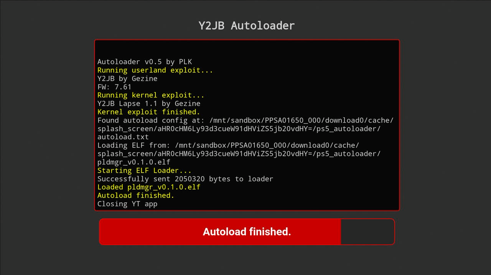

 

<h1 align="center">PS5 Y2JB Autoloader</h1>
<h3 align="center">Fork of <a href="https://github.com/Gezine/Y2JB">Y2JB</a></h3>
&nbsp;

Automatically loads the kernel exploit, elf_loader, your elf payloads, and .js scripts. Supports PS5 firmwares 4.03-10.01

    <b>Other Autoloaders:</b> 
    <a href="https://github.com/itsPLK/ps5-bdjb-autoloader">PS5 BD-JB Autoloader</a> | 
    <a href="https://github.com/itsPLK/ps5-lua-autoloader">PS5 Lua Autoloader</a>

 

## How to Use

- Create a directory named `ps5_autoloader`.
- Inside this directory, place your `.elf`, `.bin`, and `.js` files, and an `autoload.txt` file.
  - In `autoload.txt`, list the files you want to load, one filename per line.
  - Filenames are case-sensitive — ensure each name exactly matches the file.
  - You can add lines like `!1000` to make the loader wait 1000 ms before sending the next payload.
  - Do NOT include kernel exploit or elfldr in `autoload.txt`; they are loaded automatically.
- Put the `ps5_autoloader` directory in one of these locations (priority order - highest first):
  - Root of a USB drive
  - Internal drive: `/data/ps5_autoloader`
  - The YT's splash_screen folder: `download0/cache/splash_screen/aHR0cHM6Ly93d3cueW91dHViZS5jb20vdHY=/ps5_autoloader`

## How to Update

Since version **v0.2**, you can update the autoloader by simply placing **`y2jb_update.zip`** (from the [Releases page](https://github.com/itsPLK/ps5_y2jb_autoloader/releases)) on the **root** of a USB drive, and starting the app.

## Setup Instructions

Installation is the same as the original [Y2JB](https://github.com/Gezine/Y2JB/blob/main/README.md) (remote loader).

### Jailbroken PS5 (Webkit, Lua, BD-JB)
- Install correct YouTube version (v1.03).
- Use FTP to place `download0.dat` from releases page in `/user/download/PPSA0165*`

### Non-Jailbroken PS5
You might find a system backup with pre-configured Autoloader (I don't distribute such backups).

You can also restore [Y2JB](https://github.com/Gezine/Y2JB) (remote loader) system backup, and then:
- install Autoloader over it by using [y2jb_updater](https://github.com/itsPLK/y2jb_updater)
- or use FTP to place `download0.dat` from releases page in `/user/download/PPSA01650`
- or install separate YT app from different region, and use FTP to place `download0.dat` from releases page in `/user/download/PPSA0165*`

## Additional Info

<i>How to have different autoload configs for multiple YT apps?</i>

If you want to use multiple YT apps from different regions,
name your directory <code>ps5_autoloader_[TITLE_ID]</code>, e.g. <code>ps5_autoloader_PPSA01650</code>
this will allow you to have different autoload.txt files for each app
(these directories always take precedence over the generic ps5_autoloader directory)

<i>How to use custom ELF Loader version?</i>

By default, the autoloader uses a custom version of **elfldr** that only accepts connections from the PS5 itself (localhost). This improves security by preventing other devices on your network from sending payloads to your console.

If you want to use a "normal" ELF Loader that allows sending payloads from any device:
1. Place your `elfldr.elf` in the `ps5_autoloader` directory.
2. Add `elfldr.elf` as the **first** line in your `autoload.txt`.

<i>etaHEN loading stability issues</i>

Sometimes etaHEN will fail to load. It seems that etaHEN/kstuff often won't finish loading until the YouTube app is closed.

**Recommended Solution:**
Since version **v0.5**, the autoloader includes **Payload Manager**. Using it is the most reliable way to load etaHEN/kstuff, as it waits for the YouTube app to close before sending the payloads. To use it, make `pldmgr.elf` the **only** item in your `autoload.txt`.

**Alternative Workarounds:**
- Disable etaHEN toolbox automatic injecting.
- Load etaHEN without kstuff and then load kstuff separately.
- Minimize the YT app (by holding the PS button) after running lapse but before etaHEN loads.
- Add a delay before loading etaHEN to give yourself more time to minimize.

## Credits

* **[Gezine](https://github.com/Gezine)** - creator of the original [Y2JB](https://github.com/Gezine/Y2JB)
* **[shahrilnet](https://github.com/shahrilnet), [null_ptr](https://github.com/n0llptr)** - Referenced many codes from [Remote Lua Loader](https://github.com/shahrilnet/remote_lua_loader)
* **[BenNoxXD](https://github.com/BenNoxXD)** - [ClosePlayer](https://github.com/BenNoxXD/PS5-BDJ-HEN-loader) reference
* **[ntfargo](https://github.com/ntfargo)** - Thanks for providing V8 CVEs and CTF writeups
* **abc and psfree team** - Lapse implementation
* **[flat_z](https://github.com/flatz) and [LM](https://github.com/LightningMods)** - Helping implement GPU rw using direct ioctl
* **[john-tornblom](https://github.com/john-tornblom) and [EchoStretch](https://github.com/EchoStretch)** - Providing elfldr.elf payload
* **[hammer-83](https://github.com/hammer-83)** - Various BD-J PS5 exploit references
* **[zecoxao](https://github.com/zecoxao), [idlesauce](https://github.com/idlesauce), and [TheFlow](https://github.com/theofficialflow)** - Helping troubleshoot dlsym
* **[Dr.Yenyen](https://github.com/DrYenyen) and PS5 R&D community** - Testing Y2JB
* **Rush** - Creating Y2JB backup file

## License

This project is licensed under the **GPL-3.0 License**.

The original **Y2JB** base code remains under its original **MIT License** (see [LICENSE-MIT](LICENSE-MIT)).  
All unique modifications and additions in this fork are licensed under **GPL-3.0**.

## Disclaimer

This tool is provided as-is for research and development purposes only. Use at your own risk. The developers are not responsible for any damage, data loss, or consequences resulting from the use of this software.

## Donate
- [donate to Gezine](https://github.com/sponsors/Gezine)
- [donate to PLK](DONATE.md)
